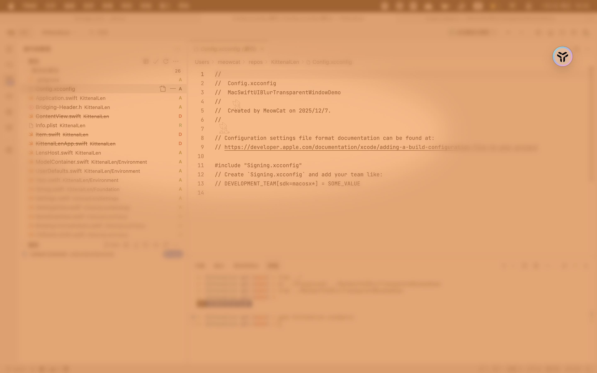

# KittenalLen

Kittenal screen filter (len) for eye protection.

It is really tiring to read books and webpages full of black and thick texts.

**This app blurs and color-blend the screen(s)** except the area around the mouse cursor.

It is NOT designed to effectively prevent myopia progression, but it may help.

 - Aligns with the theory that peripheral vision can dominate refractive development \[[ref](https://pmc.ncbi.nlm.nih.gov/articles/PMC3371664/)\]
 - Aligns with the contrast theory of myopia \[[ref](https://pmc.ncbi.nlm.nih.gov/articles/PMC11534017/#sec2)\]
 - Partially aligns with the longitudinal chromatic aberration / defocus theory of myopia, according to which myopic eyes are already unable to detect defocus \[[ref](https://pubmed.ncbi.nlm.nih.gov/36522540/)\]
 - Conflicts with the blur theory of myopia, according to which blurring causes myopia \[[ref](https://www.sciencedirect.com/science/article/pii/S0042698902002584?via%3Dihub)\]
 - Potentially conflicts with the observation that under-correction situation enhances myopia. Note that in this app the center of view field is not blurred \[[ref](https://pubmed.ncbi.nlm.nih.gov/16907670/)\]

Again, it is really tiring to read books and webpages full of black and thick texts.
